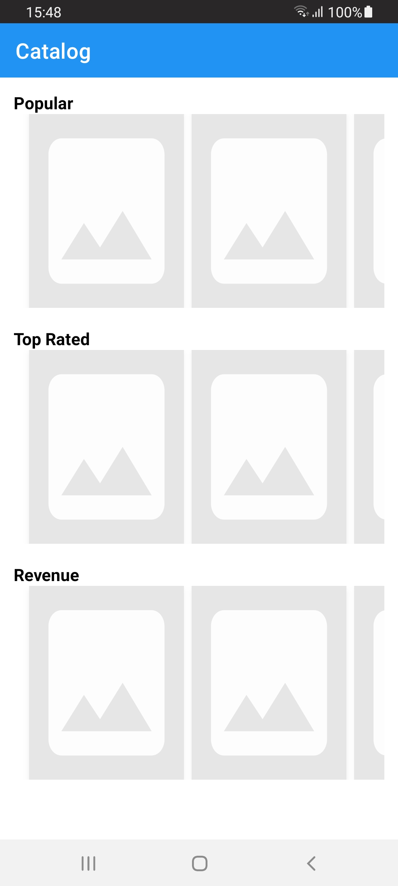
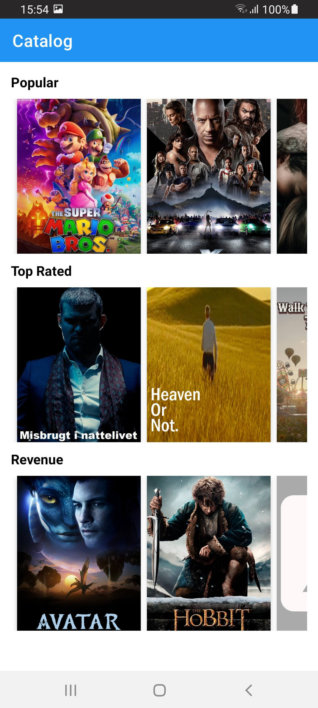
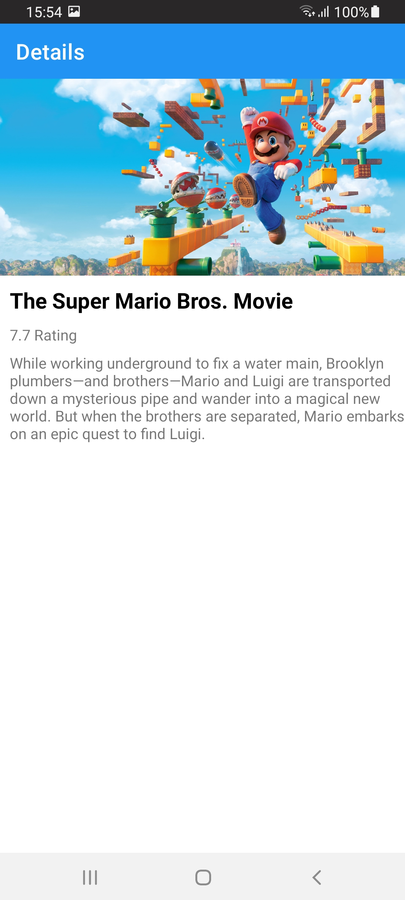
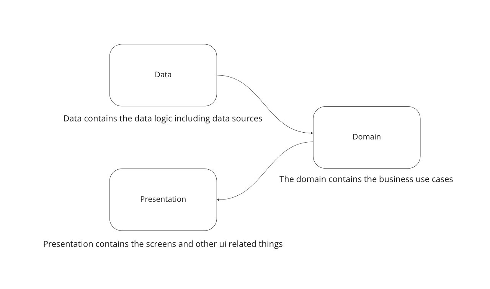

# BleacherReportTask

- [Screenshots](#Screenshots)
- [Implementation Details](#implementation-details)
- [Unit Testing](#unit-testing)
- [Running the Example](#run-sample)
- [Requirements](#requirements)
- [Dependencies](#Dependencies)

## Screenshots

| Idle  |  Listing | Details |
|---|---|---|
|   | |

## Implementation Details
  ### Architecture
 I introduced clean architecture as follows:
   * Domain
   * Data
   * Presentation



### Tech stack
 * `Async-Await` for concurrency 
 * `SwiftUI` for UI components
 * `Published` for ViewStates
 * `XCConfig` for Environments
 * Basic `Dependency injection` using constructors
 * Local `SPM` for networking layer


 ### Folder structure
 * DataAcess
    
   This layer is responsible to collect data from sources in our case we have a single remote data source `PhotosDataSource` to call API requests and `PhotosRepository` to collect data from `PhotosDataSource` and re-map it to the `domain` layer
    ``` 
        |____DataAccess
        | |____Endpoints
        | | |____PhotosEndpoint.swift
        | | |____AppEndpoint.swift
        | |____ErrorMapper
        | | |____RequestErrorMapper.swift
        | |____Models
        | | |____Response
        | | | |____PhotosResponse.swift
        | | | |____ErrorResponse.swift
        | | |____Request
        | | | |____SearchQuery.swift
        | |____PhotosRepository.swift
        | |____PhotosDataSource.swift
    ```
* Domain

    This layer is responsible to get data from `Photo Repository` and apply the business logic if needed and re-map data to be ready to the `UI` layer, and we use DTOs approach for data mapping
    ``` 
        |____Domain
        | |____SearchPhotosUseCase.swift
        | |____DTOMapper
        | | |____PhotosResponse+Dto.swift
        | |____DTOs
        | | |____PhotoDtoList.swift
        | | |____PageInfo.swift
    ```
* UI

   This layer is just a presentation including `UIComponents`, `screens` and `ViewModel` for communication between domain layer and UI

    ```
        |____UI
        | |____PhotoSearch
        | | |____SearchPhotosViewModel.swift
        | | |____Components
        | | | |____SearchView.swift
        | | | |____PhotoRowView.swift
        | | | |____StateViews
        | | | | |____SearchEmptyView.swift
        | | | | |____NoResultEmptyView.swift
        | | | | |____EmptyStateView.swift
        | | | | |____ErrorView.swift
        | | | |____URLImage.swift
        | | |____SearchPhotoScreen.swift
        | | |____ImageViewer.swift
        |____BleacherReportTaskApp.swift
    ```
## Unit Testing
   ### Networking SPM
   
   

   ### Main App
   I covered just the data and domain layer using the upper lower approach 
   


## Running the Example
1. Clone this repository
2. Open `BleacherReportTask.xcodeproj` in Xcode. 

## Requirements
- Xcode 14.x+
- Swift 5.0+
- iOS 15.0+

## Dependencies
- [Kingfisher](https://github.com/onevcat/Kingfisher)